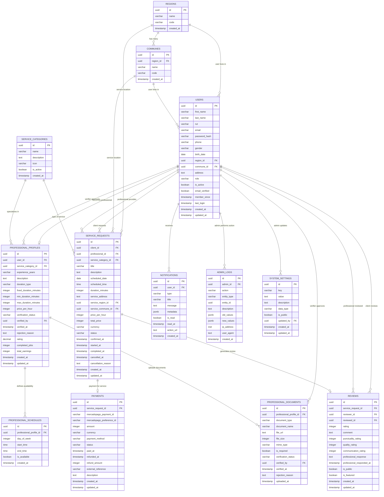

# 📊 MODELO RELACIONAL SERVIHOGAR
## Diagrama de Relaciones Entre Tablas



## 🔗 RELACIONES DETALLADAS

### **1. RELACIONES GEOGRÁFICAS**
```sql
-- Una región tiene muchas comunas
regions (1) ←→ (N) communes

-- Un usuario vive en una región y comuna
users (N) ←→ (1) regions
users (N) ←→ (1) communes

-- Una solicitud se realiza en una región y comuna específica
service_requests (N) ←→ (1) regions (service_region_id)
service_requests (N) ←→ (1) communes (service_commune_id)
```

### **2. RELACIONES DE USUARIOS**
```sql
-- Un usuario puede tener un perfil profesional (relación 1:1)
users (1) ←→ (0,1) professional_profiles

-- Un usuario (cliente) puede hacer muchas solicitudes
users (1) ←→ (N) service_requests (client_id)

-- Un usuario (profesional) puede recibir muchas solicitudes
users (1) ←→ (N) service_requests (professional_id)

-- Un usuario recibe muchas notificaciones
users (1) ←→ (N) notifications

-- Un usuario (cliente) puede escribir muchas reseñas
users (1) ←→ (N) reviews (reviewer_id)

-- Un usuario (profesional) puede recibir muchas reseñas
users (1) ←→ (N) reviews (reviewed_id)
```

### **3. RELACIONES DE VERIFICACIÓN**
```sql
-- Un verificador aprueba muchos perfiles profesionales
users (1) ←→ (N) professional_profiles (verified_by)

-- Un verificador aprueba muchos documentos
users (1) ←→ (N) professional_documents (verified_by)

-- Un administrador realiza muchas acciones (logs)
users (1) ←→ (N) admin_logs (admin_id)

-- Un administrador actualiza configuraciones
users (1) ←→ (N) system_settings (updated_by)
```

### **4. RELACIONES DE SERVICIOS**
```sql
-- Una categoría de servicio tiene muchos profesionales
service_categories (1) ←→ (N) professional_profiles

-- Una categoría de servicio tiene muchas solicitudes
service_categories (1) ←→ (N) service_requests
```

### **5. RELACIONES DE PROFESIONALES**
```sql
-- Un perfil profesional tiene muchos documentos
professional_profiles (1) ←→ (N) professional_documents

-- Un perfil profesional tiene muchos horarios
professional_profiles (1) ←→ (N) professional_schedules
```

### **6. RELACIONES DE TRANSACCIONES**
```sql
-- Una solicitud tiene un pago
service_requests (1) ←→ (1) payments

-- Una solicitud puede tener una reseña
service_requests (1) ←→ (0,1) reviews
```

## 📋 TIPOS DE RELACIONES

### **RELACIONES 1:1 (Uno a Uno)**
- `users` ↔ `professional_profiles` - Un usuario puede ser profesional
- `service_requests` ↔ `payments` - Una solicitud tiene un pago
- `service_requests` ↔ `reviews` - Una solicitud puede tener una reseña

### **RELACIONES 1:N (Uno a Muchos)**
- `regions` ↔ `communes` - Una región tiene muchas comunas
- `users` ↔ `service_requests` (como cliente o profesional)
- `professional_profiles` ↔ `professional_documents`
- `professional_profiles` ↔ `professional_schedules`
- `users` ↔ `notifications`
- `service_categories` ↔ `professional_profiles`

### **RELACIONES N:M (Muchos a Muchos)**
No hay relaciones directas N:M en este modelo. Todas las relaciones complejas se manejan a través de tablas intermedias o relaciones 1:N.

## 🔧 CLAVES FORÁNEAS CRÍTICAS

### **Integridad Referencial**
```sql
-- Cascada en eliminación para mantener consistencia
professional_profiles.user_id → users.id (CASCADE)
professional_documents.professional_profile_id → professional_profiles.id (CASCADE)
professional_schedules.professional_profile_id → professional_profiles.id (CASCADE)
notifications.user_id → users.id (CASCADE)

-- Restricción en eliminación para preservar datos históricos
service_requests.client_id → users.id (RESTRICT)
service_requests.professional_id → users.id (RESTRICT)
payments.service_request_id → service_requests.id (RESTRICT)
reviews.service_request_id → service_requests.id (RESTRICT)
```

## 🎯 CONSULTAS TÍPICAS OPTIMIZADAS

### **Búsqueda de Profesionales**
```sql
-- Profesionales por región, servicio y calificación
SELECT pp.*, u.first_name, u.last_name, r.name as region, sc.name as service
FROM professional_profiles pp
JOIN users u ON pp.user_id = u.id
JOIN regions r ON u.region_id = r.id
JOIN service_categories sc ON pp.service_category_id = sc.id
WHERE u.region_id = ? 
  AND pp.service_category_id = ?
  AND pp.rating >= ?
  AND pp.verification_status = 'approved'
ORDER BY pp.rating DESC, pp.completed_jobs DESC;
```

### **Historial de Solicitudes del Cliente**
```sql
-- Solicitudes con estado de pago y reseña
SELECT sr.*, p.status as payment_status, r.rating
FROM service_requests sr
LEFT JOIN payments p ON sr.id = p.service_request_id
LEFT JOIN reviews r ON sr.id = r.service_request_id
WHERE sr.client_id = ?
ORDER BY sr.created_at DESC;
```

### **Dashboard del Profesional**
```sql
-- Métricas del profesional con ganancias y calificaciones
SELECT 
    pp.*,
    COUNT(sr.id) as total_services,
    SUM(CASE WHEN sr.status = 'completed' THEN sr.total_price ELSE 0 END) as total_earnings,
    AVG(r.rating) as avg_rating,
    COUNT(r.id) as review_count
FROM professional_profiles pp
LEFT JOIN service_requests sr ON pp.user_id = sr.professional_id
LEFT JOIN reviews r ON sr.id = r.service_request_id
WHERE pp.user_id = ?
GROUP BY pp.id;
```

Este modelo relacional está optimizado para las funcionalidades de ServiHogar y mantiene la integridad de datos mientras permite consultas eficientes para todas las operaciones de la plataforma.