# Diagrama Relacional ServiHogar - Mermaid ERD

## Instrucciones de Uso

Copie el código Mermaid de abajo y péguelo en:
- **Mermaid Live Editor**: https://mermaid.live/
- **GitHub/GitLab** (en archivos .md)
- **Notion, Obsidian** u otros editores que soporten Mermaid
- **Visual Studio Code** con extensión Mermaid

## Código Mermaid ERD

```mermaid
erDiagram
    %% =================================================================
    %% MODELO RELACIONAL SERVIHOGAR - SISTEMA DE PRECIOS FIJOS
    %% =================================================================
    
    %% Tablas Geográficas
    region {
        uuid id_region PK
        varchar nombre "UNIQUE"
        varchar codigo "UNIQUE"
        timestamp creado_en
    }
    
    comuna {
        uuid id_comuna PK
        uuid id_region FK
        varchar nombre
        varchar codigo
        timestamp creado_en
    }
    
    %% Servicios
    categoria_servicio {
        uuid id_categoria_servicio PK
        varchar nombre "UNIQUE (Gasfitería, Limpieza, Jardinería)"
        text descripcion
        varchar icono
        boolean esta_activo
        timestamp creado_en
    }
    
    %% Usuarios
    usuario {
        uuid id_usuario PK
        varchar nombres
        varchar apellidos
        varchar rut "UNIQUE (RUT chileno)"
        varchar email "UNIQUE"
        varchar hash_contrasena
        varchar telefono
        varchar genero "CHECK (masculino/femenino/otro)"
        date fecha_nacimiento
        uuid id_region FK
        uuid id_comuna FK
        text direccion "OBLIGATORIO"
        varchar rol "CHECK (cliente/profesional/admin/verificador)"
        boolean esta_activo
        boolean email_verificado
        timestamp miembro_desde
        timestamp ultimo_acceso
        timestamp creado_en
        timestamp actualizado_en
    }
    
    %% Profesionales - Perfil General
    perfil_profesional {
        uuid id_perfil_profesional PK
        uuid id_usuario FK "UNIQUE"
        text descripcion_general
        varchar telefono_profesional
        varchar estado_verificacion_general "CHECK (pendiente/aprobado/rechazado/suspendido)"
        uuid id_verificado_por FK
        timestamp verificado_en
        text razon_rechazo
        decimal calificacion_promedio "CHECK (0-5) - Calculada"
        integer total_trabajos_completados "Suma de todos los servicios"
        integer total_ganancias "CLP - Suma de todos los servicios"
        boolean esta_activo
        boolean acepta_nuevos_trabajos
        timestamp creado_en
        timestamp actualizado_en
    }
    
    %% Servicios Específicos del Profesional
    servicio_profesional {
        uuid id_servicio_profesional PK
        uuid id_usuario FK
        uuid id_categoria_servicio FK
        varchar anos_experiencia
        text descripcion
        varchar tipo_duracion "CHECK (fija/rango) - SOLO INFORMATIVO"
        integer duracion_fija_minutos "INFORMATIVO"
        integer duracion_minima_minutos "INFORMATIVO"
        integer duracion_maxima_minutos "INFORMATIVO"
        integer precio_fijo "PRECIO FIJO DEL SERVICIO"
        boolean esta_activo "HABILITAR/DESHABILITAR SERVICIO"
        boolean esta_disponible "Para pausas temporales"
        varchar estado_verificacion "CHECK (pendiente/aprobado/rechazado/suspendido)"
        uuid id_verificado_por FK
        timestamp verificado_en
        text razon_rechazo
        decimal calificacion "CHECK (0-5)"
        integer trabajos_completados
        integer ganancias_totales "CLP"
        timestamp creado_en
        timestamp actualizado_en
    }
    
    documento_profesional {
        uuid id_documento_profesional PK
        uuid id_perfil_profesional FK
        varchar tipo_documento "CHECK (cedula/antecedentes/certificado/experiencia/titulo)"
        varchar nombre_documento
        text url_archivo
        integer tamano_archivo
        varchar tipo_mime
        boolean es_obligatorio "Antecedentes = TRUE"
        varchar estado_verificacion "CHECK (pendiente/aprobado/rechazado)"
        uuid id_verificado_por FK
        timestamp verificado_en
        text razon_rechazo
        timestamp subido_en
    }
    
    horario_profesional {
        uuid id_horario_profesional PK
        uuid id_perfil_profesional FK
        integer dia_semana "CHECK (0-6: 0=Domingo, 6=Sábado)"
        time hora_inicio
        time hora_fin
        boolean esta_disponible
        timestamp creado_en
    }
    
    %% Servicios y Transacciones
    solicitud_servicio {
        uuid id_solicitud_servicio PK
        uuid id_cliente FK
        uuid id_profesional FK
        uuid id_categoria_servicio FK
        varchar titulo
        text descripcion
        date fecha_programada
        time hora_programada
        integer duracion_minutos "SOLO INFORMATIVO"
        text direccion_servicio
        uuid id_region_servicio FK
        uuid id_comuna_servicio FK
        integer precio_por_hora "PRECIO FIJO"
        integer precio_total "= precio_por_hora"
        varchar moneda "DEFAULT CLP"
        varchar estado "CHECK (pendiente/confirmado/en_progreso/completado/cancelado/en_disputa)"
        timestamp confirmado_en
        timestamp iniciado_en
        timestamp completado_en
        timestamp cancelado_en
        text razon_cancelacion
        timestamp creado_en
        timestamp actualizado_en
    }
    
    pago {
        uuid id_pago PK
        uuid id_solicitud_servicio FK
        varchar id_pago_mercadopago "UNIQUE"
        varchar id_preferencia_mercadopago
        integer monto "CLP"
        varchar moneda "DEFAULT CLP"
        varchar metodo_pago
        varchar estado "CHECK (pendiente/aprobado/autorizado/en_proceso/rechazado/cancelado/reembolsado)"
        timestamp pagado_en
        timestamp reembolsado_en
        integer monto_reembolso
        varchar referencia_externa
        text descripcion
        timestamp creado_en
        timestamp actualizado_en
    }
    
    %% Reseñas y Comunicación
    resena {
        uuid id_resena PK
        uuid id_solicitud_servicio FK "UNIQUE"
        uuid id_evaluador FK "Cliente"
        uuid id_evaluado FK "Profesional"
        integer calificacion "CHECK (1-5)"
        text comentario
        integer calificacion_puntualidad "CHECK (1-5)"
        integer calificacion_calidad "CHECK (1-5)"
        integer calificacion_comunicacion "CHECK (1-5)"
        text respuesta_profesional
        timestamp profesional_respondio_en
        boolean es_publica
        boolean es_destacada "Para testimonios"
        timestamp creado_en
        timestamp actualizado_en
    }
    
    notificacion {
        uuid id_notificacion PK
        uuid id_usuario FK
        varchar tipo "solicitud_servicio/pago/resena/verificacion"
        varchar titulo
        text mensaje
        jsonb metadatos
        boolean esta_leida
        timestamp leida_en
        text url_accion
        timestamp creado_en
    }
    
    %% Administración
    log_administrador {
        uuid id_log_administrador PK
        uuid id_administrador FK
        varchar accion
        varchar tipo_entidad
        uuid id_entidad
        text descripcion
        jsonb valores_anteriores
        jsonb valores_nuevos
        inet direccion_ip
        text agente_usuario
        timestamp creado_en
    }
    
    configuracion_sistema {
        uuid id_configuracion_sistema PK
        varchar clave "UNIQUE"
        text valor
        text descripcion
        varchar tipo_dato "CHECK (string/integer/boolean/json)"
        boolean es_publico
        uuid id_actualizado_por FK
        timestamp creado_en
        timestamp actualizado_en
    }
    
    %% =================================================================
    %% RELACIONES
    %% =================================================================
    
    %% Geográficas
    region ||--o{ comuna : "tiene (id_region)"
    region ||--o{ usuario : "ubicado_en (id_region)"
    comuna ||--o{ usuario : "vive_en (id_comuna)"
    region ||--o{ solicitud_servicio : "servicio_en_region (id_region_servicio)"
    comuna ||--o{ solicitud_servicio : "servicio_en_comuna (id_comuna_servicio)"
    
    %% Usuarios y Roles
    usuario ||--o| perfil_profesional : "puede_tener (id_usuario)"
    usuario ||--o{ solicitud_servicio : "cliente_solicita (id_cliente)"
    usuario ||--o{ solicitud_servicio : "profesional_realiza (id_profesional)"
    usuario ||--o{ resena : "cliente_evalua (id_evaluador)"
    usuario ||--o{ resena : "profesional_evaluado (id_evaluado)"
    usuario ||--o{ notificacion : "recibe (id_usuario)"
    usuario ||--o{ log_administrador : "administrador_acciona (id_administrador)"
    usuario ||--o{ configuracion_sistema : "actualiza (id_actualizado_por)"
    
    %% Profesionales
    usuario ||--o| perfil_profesional : "tiene_perfil_general (id_usuario)"
    usuario ||--o{ servicio_profesional : "ofrece_servicios (id_usuario)"
    categoria_servicio ||--o{ servicio_profesional : "tipo_de_servicio (id_categoria_servicio)"
    perfil_profesional ||--o{ documento_profesional : "sube (id_perfil_profesional)"
    perfil_profesional ||--o{ horario_profesional : "define (id_perfil_profesional)"
    usuario ||--o{ documento_profesional : "verificador_revisa (id_verificado_por)"
    usuario ||--o{ perfil_profesional : "verificador_aprueba_perfil (id_verificado_por)"
    usuario ||--o{ servicio_profesional : "verificador_aprueba_servicio (id_verificado_por)"
    
    %% Servicios
    categoria_servicio ||--o{ solicitud_servicio : "tipo_de (id_categoria_servicio)"
    servicio_profesional ||--o{ solicitud_servicio : "servicio_especifico_contratado"
    solicitud_servicio ||--|| pago : "requiere (id_solicitud_servicio)"
    solicitud_servicio ||--o| resena : "puede_tener (id_solicitud_servicio)"
    
    %% =================================================================
    %% CARACTERÍSTICAS ESPECIALES
    %% =================================================================
    
    %%{init: {
        'theme': 'base',
        'themeVariables': {
            'primaryColor': '#10b981',
            'primaryTextColor': '#ffffff',
            'primaryBorderColor': '#047857',
            'lineColor': '#6b7280',
            'secondaryColor': '#f3f4f6',
            'tertiaryColor': '#ffffff'
        }
    }}%%
```

## Información del Modelo

### 🎯 **Sistema de Precios Fijos**
- ✅ `precio_por_hora` = **Precio fijo del servicio completo**
- ✅ `precio_total` = **Siempre igual al precio fijo**
- ✅ `duracion_*` = **Solo informativa para planificación**

### 📊 **Métricas Clave**
- **12 tablas principales**
- **4 roles de usuario**: cliente, profesional, administrador, verificador
- **3 categorías de servicio**: Gasfitería, Limpieza del Hogar, Jardinería
- **16 regiones de Chile** con comunas

### 🔐 **Características de Seguridad**
- UUIDs como claves primarias
- Constraints CHECK para validaciones
- Triggers automáticos para `actualizado_en`
- Sistema de roles granular
- Logging completo de acciones administrativas

### 🌟 **Funcionalidades Destacadas**
- **Verificación de profesionales** con documentos obligatorios
- **Sistema de reseñas** con calificaciones específicas
- **Integración MercadoPago** completa
- **Notificaciones** por tipo y usuario
- **Horarios semanales** configurables
- **Geolocalización** por región/comuna chilena

---

**Versión**: Base de Datos en Español  
**Fecha**: Enero 2025  
**Estado**: ✅ Sistema de Precios Fijos Implementado